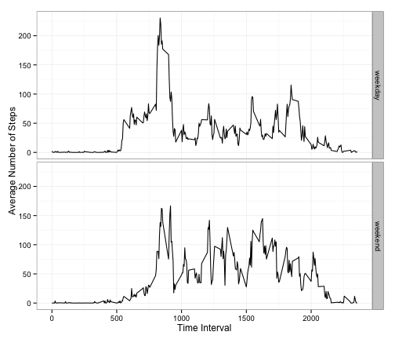

# Reproducible Research: Peer Assessment 1

## Loading and preprocessing the data

```r
library(ggplot2)
df <- read.csv("activity.csv", colClasses = c("numeric", "Date", "numeric"))
```


## What is mean total number of steps taken per day?
Calculating the total number of steps taken each day using `aggregate` function and plotting the histogram:

```r
df.total <- aggregate(steps ~ date, data = df, sum, na.rm = TRUE)
hist(df.total$steps, breaks = seq(0, 22000, 2000), xlab = "Number of steps taken each day", 
    main = "Histogram of number of steps taken each day")
```

 

Average and median number of steps taken each day:

```r
mean(df.total$steps)
```

```
## [1] 10766
```

```r
median(df.total$steps)
```

```
## [1] 10765
```


## What is the average daily activity pattern?
Calculating the average number of steps taken during each 5-minute time interval each day. Averaging is done over different days keeping the same time inteval number:

```r
df.average = aggregate(steps ~ interval, data = df, mean, na.rm = TRUE)
row.names(df.average) = df.average$interval
```


```r
plot(df.average$interval, df.average$steps, type = "l", xlab = "Interval", ylab = "Average Number of Steps", 
    main = "Average number of steps taken in the same time interval each day")
```

 


Interval with the maximum average number of steps is:

```r
df$interval[which.max(df.average$steps)]
```

```
## [1] 835
```


## Imputing missing values
The number of NA elements in the data is:

```r
sum(is.na(df))
```

```
## [1] 2304
```


Imputing missing values using average number of steps done in the same time interval over multiple days. The number of step differs significantly during time intervals at different part of the day. E.g. there are very few steps taken during night time intervals. Ideally we also need to distinguish if the time interval is during weekday or weekend. For now we keep it simple and just consider the interval number.

```r
nas = is.na(df$steps)
df.new <- df
df.new$steps[nas] <- df.average[as.character(df$interval[nas]), 2]
```


```r
df.total.new <- aggregate(steps ~ date, data = df.new, sum)
hist(df.total.new$steps, breaks = seq(0, 22000, 2000), xlab = "Number of steps taken each day", 
    main = "Histogram of number of steps taken each day\nafter filling missing values")
```

 


Mean and meadian after filling the missing values.

```r
mean(df.total.new$steps)
```

```
## [1] 10766
```

```r
median(df.total.new$steps)
```

```
## [1] 10766
```


## Are there differences in activity patterns between weekdays and weekends?
Adding a factor variable to indicate whether the date corresponds to weekend or weekday.

```r
df.new$weekday <- factor(weekdays(df.new$date) %in% c("Saturday", "Sunday"), 
    labels = c("weekday", "weekend"))
```

Aggregating steps by weekday and interval and creating two plots showing average number of steps on weekday and weekend for each time interval.

```r
df.new.agg <- aggregate(steps ~ weekday + interval, data = df.new, mean)
ggplot(df.new.agg, aes(x = interval, y = steps)) + geom_line() + facet_grid(weekday ~ 
    .) + xlab("Time Interval") + ylab("Average Number of Steps") + theme_bw()
```

 

